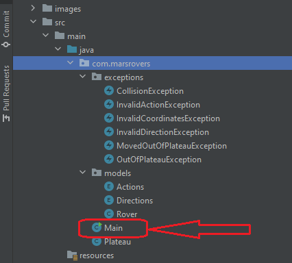

# MARS ROVER ALGORITHM

## Task Details

A squad of robotic rovers are to be landed by NASA on a plateau on Mars.
This plateau, which is curiously rectangular, must be navigated by the rovers so that their on board cameras can get a complete view of the surrounding terrain to send back to Earth.

A rover's position is represented by a combination of an x and y co-ordinates and a letter representing one of the four cardinal compass points. The plateau is divided up into a grid to simplify navigation. 
An example position might be 0, 0, N, which means the rover is in the bottom left corner and facing North.

In order to control a rover, NASA sends a simple string of letters. The possible letters are 'L', 'R' and 'M'. 'L' and 'R' makes the rover spin 90 degrees left or right respectively, without moving from its current spot.'M' means move forward one grid point, and maintain the same heading.

Assume that the square directly North from (x, y) is (x, y+1).

## Input:

The first line of input is the upper-right coordinates of the plateau, the lower-left coordinates are assumed to be 0,0.
The rest of the input is information pertaining to the rovers that have been deployed. Each rover has two lines of input. The first line gives the rover's position, and the second line is a series of instructions telling the rover how to explore the plateau.

The position is made up of two integers and a letter separated by spaces, corresponding to the x and y co-ordinates and the rover's 
orientation.

Each rover will be finished sequentially, which means that the second rover won't start to move until the first one has finished 
moving.

## Output:

The output for each rover should be its final co-ordinates and heading.

## Test Input:

5 5  
1 2 N  
LMLMLMLMM  
3 3 E  
MMRMMRMRRM  

## Expected Output:

1 3 N  
5 1 E  

__________________________________________________________________________________________________________

### NOTES TO SOLVE THE TASK: 

---

#### COORDINATES REPRESENTING PLATEAU ROVER: X and Y

#### DIRECTIONS FORMULAS (NORTH, SOUTH, WEST and EAST) 

---

#### DIRECTIONS + MOVIMENTS:

North + Right = East 
North + Left = West

South + Right = West 
South + Left = East 

West + Right = North 
West + Left = South 

East + Right = South 
East + Left = North 

__________________________________________________________________________________________________________

### HOW TO THINK ABOUT THE TASK STEP BY STEP?

__________________________________________________________________________________________________________

### PROJECT STRUCTURE

The requirement to write the solution and the TDD Tests it was thinking using the structure below:

#### Enums: 

* Actions: L (Left), R (Right) and M (Move) 
* Coordinates: N (North), S (South), E (East) and W (West)

#### Plateu (where rover will run):

* Data to clarify the size
* Rover: list of rover
* Validations: if plateau on X and Y coordinates are bigger than 0; if the rovers position is valid; colisions when rover is running

#### Rover:

* Initial position
* Directions: (N, S, E and W)
* Actions: (L, R and M)
* Validations: if position is bigger than 0, if the letter for Actions are correct
* Entry class for users run the code

__________________________________________________________________________________________________________

### HOW TO RUN THE TASK?

Clone this repository to your local machine. Open the project with IntelliJ (or other IDE) and build the project using Maven and JDK 11.

Follow the steps below:

##### Click with the right botton on Main.class: 

##### CLick on Run_'Main.main()': 

##### Inform the Plateau Size: 

##### Inform how many rovers to run: 

##### Inform the coordinates for Rover1: 

##### Inform the commands for Rover1: 

##### Inform the coordinates for Rover2: 

##### Inform the commands for Rover2: 

##### The result will be shown: 

